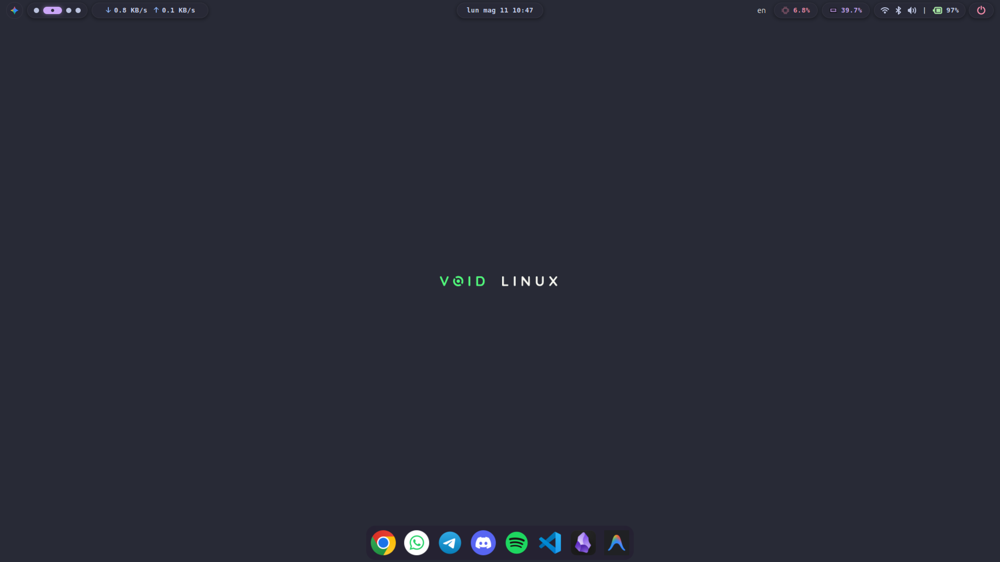

# 🚀 AngieBar - Premium GNOME Shell Extension

```text
    ___                _      ____             
   /   |  ____  ____ _(_)__  / __ )____ ______ 
  / /| | / __ \/ __ `/ / _ \/ __  / __ `/ ___/ 
 / ___ |/ / / / /_/ / /  __/ /_/ / /_/ / /     
/_/  |_/_/ /_/\__, /_/\___/_____/\__,_/_/      
             /____/                            
```


**AngieBar** is a custom, high-performance status bar for GNOME Shell, inspired by the minimalist aesthetics of Waybar and the interactive utility of modern "islands". It transforms your default GNOME panel into a modular, pill-based interface with pixel-perfect styling and real-time system monitoring.

## Features

- **Modular "Islands"**: Clean, pill-shaped containers for a modern look.
- **Real-time Monitoring**:
  - **CPU & RAM**: Dynamic usage statistics directly in the bar.
  - **Network Traffic**: Live upload and download speeds (expandable/compact view).
  - **Battery Utility**: Precise percentage and wattage monitoring (click to toggle).
- **Dynamic Media Controller**: Integrated "Dynamic Island" style media tracker with:
  - Album artwork extraction (from Firefox, Chrome, Spotify, etc.).
  - Minimalist "Nothing" style audio visualizer.
  - Smooth expansion animations.
- **Enhanced Workspaces**: Interactive dot-based workspace switcher.
- **Smart Quick Settings**: Custom access to volume (with scroll-to-change), Wi-Fi, and Bluetooth.
- **Material You Inspired**: Dynamic color adaptation based on your desktop theme.
- **Highly Customizable**: Toggle any module via the extension settings.
- **Rofi Power Menu**: Optional integration for a stylized, full-screen power management menu.

## Installation

### Quick Install (Recommended)

Run the included installation script to automatically set up the extension, compile schemas, and move files to the correct directory:

```bash
chmod +x install.sh
./install.sh
```

### Manual Installation

1. Create the extension directory:
   ```bash
   mkdir -p ~/.local/share/gnome-shell/extensions/AngieBar@garrati.com
   ```
2. Copy all files from the `AngieBar@garrati.com` folder to that directory.
3. Compile the GSettings schemas:
   ```bash
   glib-compile-schemas ~/.local/share/gnome-shell/extensions/AngieBar@garrati.com/schemas/
   ```
4. Restart GNOME Shell (Alt+F2, type `r`, and Enter, or log out and back in on Wayland).
5. Enable the extension via **GNOME Extensions** or **Extensions Manager**.

## Styling

The extension uses `stylesheet.css` for all visual elements. It is optimized for the **Catppuccin Mocha** dark theme by default but adapts dynamically to your system's color scheme if enabled in settings.

## Requirements

- **GNOME Shell**: 45 to 50
- **Dependencies**: 
  - `libadwaita`
  - `network-manager` (for Wi-Fi info)
  - `upower` (for battery stats)
  - `wireplumber` (for volume control via `wpctl`)
  - `rofi` (Optional, for the power menu)

## Rofi Power Menu

If you chose to install the Rofi configuration, you can trigger the power menu by clicking the power button on the bar. The script is located at `~/.config/rofi/powermenu.sh` and uses the `power_theme.rasi` theme.

Ensure `rofi` is installed on your system:
```bash
sudo apt install rofi  # Debian/Ubuntu
sudo pacman -S rofi    # Arch Linux
```

---

*Made with ❤️ by garrati*