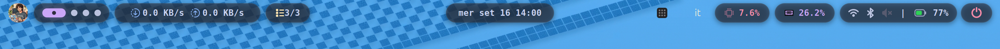

# AngieBar

```text
    ___                _      ____             
   /   |  ____  ____ _(_)__  / __ )____ ______ 
  / /| | / __ \/ __ `/ / _ \/ __  / __ `/ ___/ 
 / ___ |/ / / / /_/ / /  __/ /_/ / /_/ / /     
/_/  |_/_/ /_/\__, /_/\___/_____/\__,_/_/      
             /____/                            
```



**AngieBar** is a sleek, modern, high-performance status bar for GNOME Shell, inspired by the minimalist aesthetics of Waybar and the interactive utility of modern floating "islands". It transforms your standard GNOME panel into a modular, pill-based interface featuring pixel-perfect styling, rich hover tooltips, and real-time system monitoring.

---

## 🚀 Key Features

### 📌 Interactive Logo Island
- **Custom Logo Support**: Choose any custom PNG, JPEG, or SVG image (supports full cover fill or centered icon mode).
- **Left-Click Action**: Configurable to launch a custom command or open an interactive dropdown menu.
- **Quick-Access Menu**: Provides quick links to GNOME Settings, customizable folder shortcuts (Documents, Downloads, Desktop, Pictures), Terminal, and real-time **System Uptime**.
- **Right-Click Overview**: Toggle GNOME Overview instantly with a right click.

### 📝 Integrated To-Do List Island
- **Built-in Task Manager**: Track tasks directly from your top bar without extra apps.
- **Interactive Popup Menu**: Add new tasks, check off completed items, and clear completed entries in one click.
- **Real-Time Badge**: Displays completed vs. total task count (`X/Y`) on the bar.
- **Persistent Storage**: Automatically saves your list to `~/.config/angiebar-todos.json`.

### 🎵 Dynamic Media & Audio Visualizer Island
- **MPRIS2 Integration**: Automatically detects media playback from Spotify, Firefox, Chrome, VLC, Celluloid, and more.
- **Album Art Extraction**: Displays cover art dynamically in the island.
- **Audio Visualizer**: Minimalist "Nothing" style animated wave effect during active playback.
- **Quick Calendar**: Click the clock island to open the GNOME Date & Calendar menu.

### 📊 Real-Time System Monitors
- **CPU Usage & Stats**: Shows live total CPU load percentage. Hovering reveals core frequencies (MHz), temperatures (°C), and usage details.
- **RAM Monitor**: Displays memory load percentage. Hovering shows exact RAM usage in GB (e.g. `4.2GB / 15.6GB`).
- **Network Speed Monitor**: Live upload and download speed indicators (`KB/s` / `MB/s`). Click to toggle compact average speed view.

### 🛡️ Privacy & System Indicators
- **Privacy Indicator Island**: Automatically detects live microphone and camera activity (`PipeWire`), displaying a hover tooltip listing active apps using your hardware.
- **Quick Settings Module**: WiFi status (hover for SSID, signal %, local IP), Bluetooth state, and Volume indicator with **mouse scroll-to-change volume** support (`wpctl`).
- **Battery Utility**: Dynamic SVG battery icon rendering charge level and status colors. Click to toggle wattage draw (`W`), hover for time to full/empty.
- **Power Button**: Dedicated button for one-click power off or custom session actions.

---

## 🎨 Design & Customization

AngieBar features a built-in GTK4 / Libadwaita preferences window (`prefs.js`):

- **Module Toggles**: Easily enable or disable individual islands.
- **Color Themes & Presets**: Includes quick theme presets (Catppuccin Mocha, Catppuccin Macchiato, Nord, Dracula, Gruvbox, Dark Red, Dark Green, Absolute Black).
- **Custom Background & Opacity**: Adjust hex/rgba background colors and island transparency (`0.00` to `1.00`).
- **Accent Customization**: Change text and icon colors independently for CPU, RAM, and active workspace dots.

---

## 🛠️ Installation

### Quick Install (Script)

Clone the repository and run the installation script:

```bash
git clone https://github.com/garrati-0/AngieBar.git
cd AngieBar
chmod +x install.sh
./install.sh
```

### Manual Installation

1. Create the local extension directory:
   ```bash
   mkdir -p ~/.local/share/gnome-shell/extensions/AngieBar@garrati.com
   ```
2. Copy all files into that directory:
   ```bash
   cp -r * ~/.local/share/gnome-shell/extensions/AngieBar@garrati.com/
   ```
3. Compile the GSettings schema:
   ```bash
   glib-compile-schemas ~/.local/share/gnome-shell/extensions/AngieBar@garrati.com/schemas/
   ```
4. Restart GNOME Shell (`Alt` + `F2`, type `r`, press `Enter`, or re-login on Wayland).
5. Enable the extension using **GNOME Extensions** or **Extensions Manager**.

---

## 📋 Requirements

- **GNOME Shell**: 45 to 50
- **System Dependencies**:
  - `libadwaita` (for preferences window)
  - `network-manager` (for Wi-Fi SSID & IP info)
  - `upower` (for battery stats & wattage)
  - `wireplumber` / `pipewire` (for volume control via `wpctl` and privacy monitoring)

---

## 📄 License

Distributed under the GPL-3.0 License. See `LICENSE` for more information.

---

*Made with ❤️ by [garrati](https://github.com/garrati-0)*
